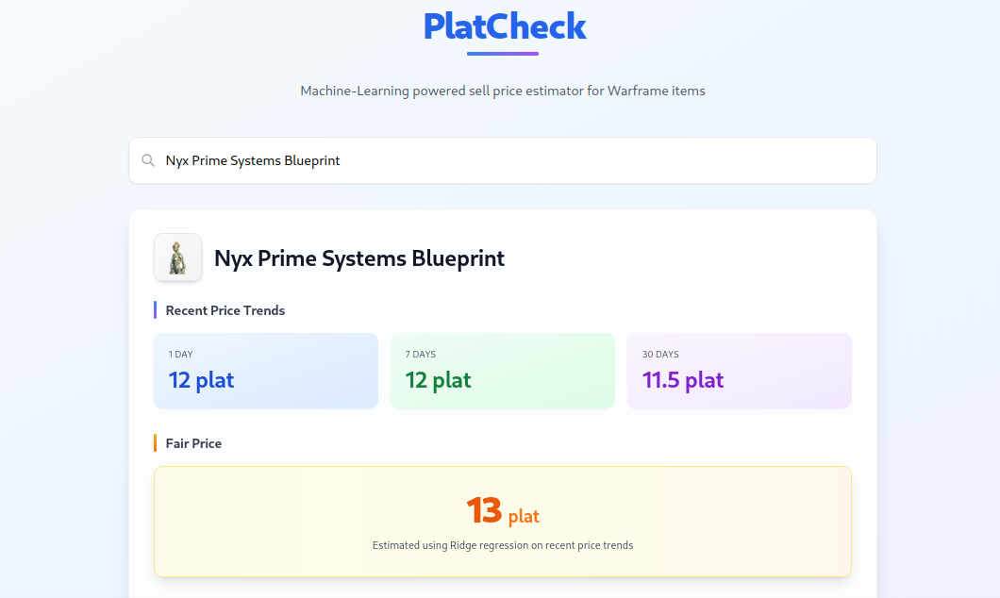

# PlatCheck - Warframe Item Sell Price Estimator

A simple web app that estimates the optimal price to sell warframe items at using Ridge Regression.



## Features

- **Price Trends**: View 1-day, 7-day, and 30-day median prices
- **Fair Price**: ML-based price estimation using Ridge Regression
- **Search**: Autocomplete search for Warframe items

## Tech Stack

- **Frontend**: Next.js with TypeScript and Tailwind CSS
- **Backend**: Next.js API routes
- **ML**: Python + scikit-learn (Ridge Regression)
- **Data Source**: Warframe.market API v2

## Setup

### Install Dependencies

```bash
# Install dependencies
npm install

# Create Python virtual environment
python -m venv venv

# Activate virtual environment
source venv/bin/activate

# Install Python dependencies
pip install "numpy>=1.24.0" "scikit-learn>=1.3.0" "requests>=2.31.0"
```

### Train the Model

```bash
# Make sure virtual environment is activated
source venv/bin/activate

# Run training script
python scripts/train_model.py
```

This will:
- Fetch historical price data from the Warframe.market API
- Train a Ridge Regression model
- Save the model to `model/model.json`

**Note**: The API has rate limiting, so this may take a while.

### 3. Run the dev server

```bash
npm run dev
```

Open [http://localhost:3000](http://localhost:3000).


### Why Ridge Regression?

Ridge Regression is a technique that finds patterns in historical prices and uses them to estimate what an item should cost.

The model uses three pieces of information to make predictions:

- **`median_1d`**: The median price from the last 1 day (current market)  
- **`median_7d`**: The median price from the last 7 days (short-term trends)  
- **`median_30d`**: The median price from the last 30 days (longer-term trends)

These medians are weighted so that days with more trading volume are more important in the calcuations.

The optimal sell price is then calculated with this formula:

```
Sell Price = Base Price + (Weight1 * median_1d) + (Weight2 * median_7d) + (Weight3 * median_30d)
```

The weights are learned through training.

### Training Workflow

1. **Get Real-Time Data**: The training script downloads historical prices for up to 200 items from the Warframe.market API
2. **Clean the Data**: 
The script:
   - Removes price outliers
   - Ignores days with low to no trading volume
3. **Build Patterns**: 
The script looks at examples of previous trades and maps:
   - Inputs: 1-day, 7-day, and 30-day medians
   - Target: the next day’s median price
4. **Train Model**:
   - Ridge Regression learns the best weights to explain how past prices relate to future ones
5. **Save the Model**:
   - The weights are stored in a JSON file

### Prediction Workflow

When a user searches for an item:

1. Get recent prices from Warframe.market API
2. Compute 1/7/30 day trends
3. Use the trained model on the trends to compute the optimal sell price
4. Bounds-check the value to within current buy/sell values
5. Return the result
